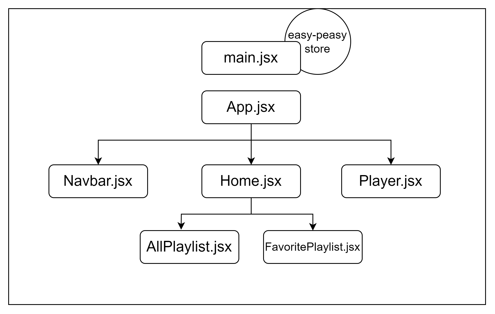

# Focused-YouTube

Focused-YouTube is a distraction-free YouTube playlist player that allows you to enjoy your favorite playlists without any interruptions. With the ability to add playlists to your favorites, remove them, navigate between videos, and more, Focused-YouTube enhances your playlist viewing experience.

## Features

- **Distraction-Free Playback**: Enjoy your YouTube playlists without distractions.
- **Playlist Management**: Easily add and remove playlists based on your preferences.
- **Favorites**: Mark your favorite playlists for quick access.
- **Navigation Controls**: Navigate through playlist videos, go to the next or previous video, or jump to a specific video.
- **Easy Setup**: Simply copy and paste the YouTube playlist link or ID to get started.

## Technologies Used

- React
- React Router
- Easy Peasy
- Material-UI
- React YouTube Player
- YouTube API

## Components Tree



## Getting Started

### Prerequisites

Make sure you have [Node.js](https://nodejs.org/) installed on your machine.

### Installation

1. Clone the repository:

   ```bash
   git clone https://github.com/readwanmd/focused-youtube.git
   ```

2. Navigate to the project directory:

   ```bash
   cd focused-youtube
   ```

3. Install dependencies:

   ```bash
   yarn
   ```

### Configuration

1. Obtain a YouTube API key by following the [YouTube API documentation](https://developers.google.com/youtube/v3/getting-started).
2. Create a `.env` file in the project root and add your API key:

   ```env
   VITE_API_KEY=your-api-key-here
   ```

### Usage

1. Start the development server:

   ```bash
   yarn dev
   ```

2. Open your browser and navigate to `http://localhost:5173/`.

3. Copy and paste a YouTube playlist link or ID into the application.

4. Explore the distraction-free playlist experience!

## Acknowledgments

- Thanks to the creators of the technologies used in this project.
- Special thanks to the YouTube API for enabling seamless playlist integration.
